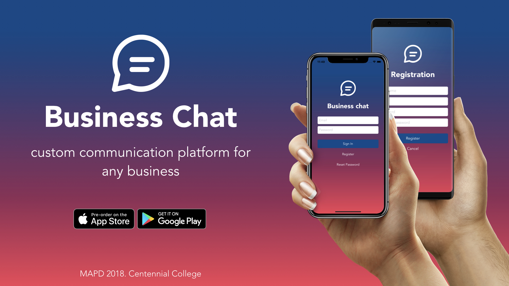
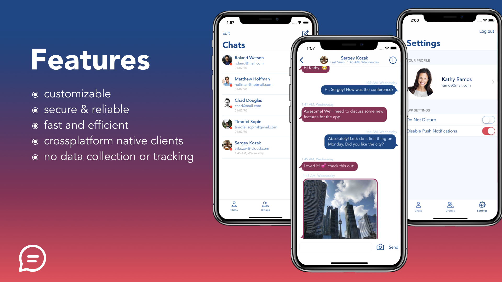
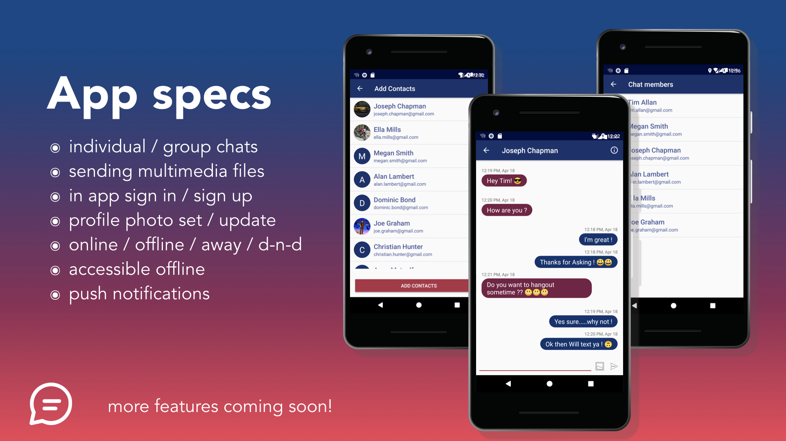
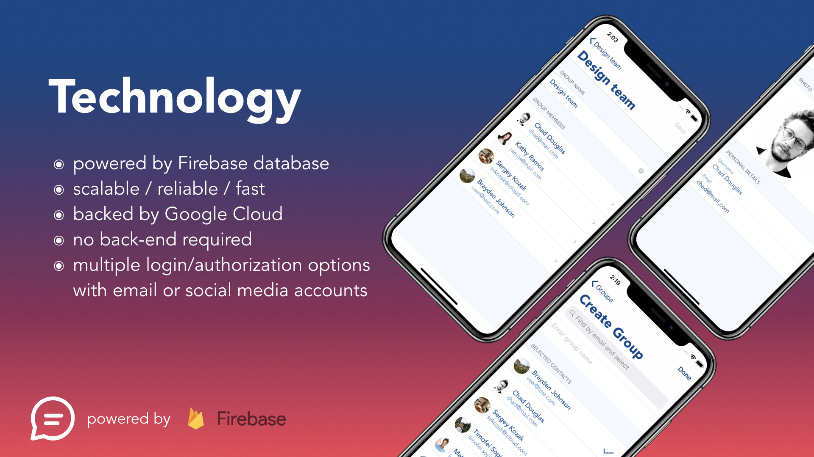
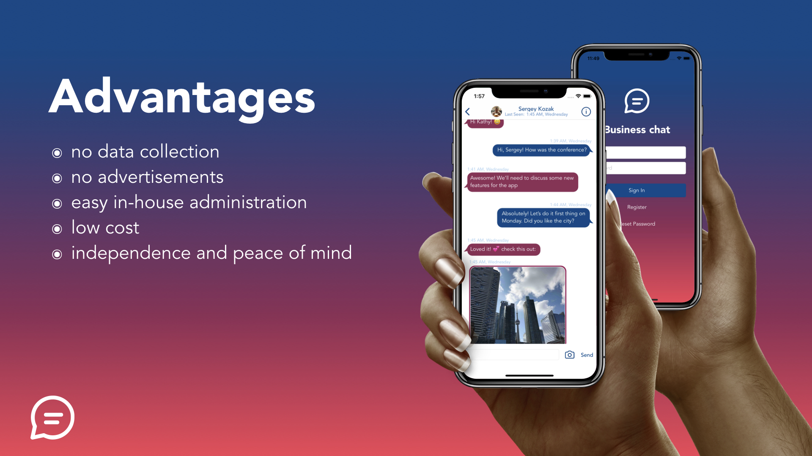

# Business Chat App - capstone project

Cross-platform (iOS, Android, Web) business messenger application with Firebase back end.
Built by a team of 7 students with 2 developers per platform.

**Features:**
* in-app registration with email and password
* personal and group chats
* viewing and changing group chat information
* contact list search
* online / offline / away / do not disturb status
* in-app profile image setting or updating
* sending photos from camera or library
* view photos full-screen
* in-app updating of email & password

## Presentation slides with screenshots

These are the keynote slides we created for Centennial College Tech Fair 2018, where the project was presented.
The slides feature real screenshots from the app.

---

---

---

---

